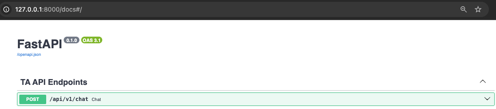

# dummy-ta

This is a dummy implementation of the TA API.

## Dependencies

The project uses the following Python libraries:

- `llama-cpp-python`: Python binding for [llama.cpp](https://github.com/ggerganov/llama.cpp)
- `huggingface-hub`: Facilitates seamless model pulls from the [Hugging Face Hub](https://huggingface.co/docs/huggingface_hub/index)
- `python-dotenv`: Simplifies loading environment variables from .env files.
- `fastapi`: Modern and fast API framework.
- `uvicorn`: ASGI server for serving FastAPI applications.

## Requirements

- `Docker`: For containerized development and production environments.
- `Docker Compose`: To manage multi-container Docker applications. Currently only runs chat-service, but is prepared for future integration of additional services (like langfuse or databases).
- `Poetry`: For dependency management when running locally. Install it [here](https://python-poetry.org/docs/).

## How to Run
- remember to create a `.env` file from the `.dev.env` file and set the correct values for the environment variables.

### Using Docker

```bash
# Build and run the Docker container:
docker compose up chat-service
```

### Running Locally

1. Install Poetry: 
- Follow the installation instructions at Poetry's official site [here](https://python-poetry.org/docs/).

2. Install Dependencies:

```bash
poetry install
```

3. Run the Chat Service:

```bash
# using poetry directly
poetry run uvicorn app.main:app --reload

# Or using Makefile rule
make chat-api-service
```
## Testing the API:

- via curl request
```bash
# curl request
curl -X 'POST' \
  'http://127.0.0.1:8000/api/v1/chat' \
  -H 'accept: application/json' \
  -H 'Content-Type: application/json' \
  -d '{
  "prompt": "what is a llm"
}'

# output example (Qwen2-0.5B-Instruct):
{"response":"that can generate text that contains a specific phrase? Could you please provide me with some examples of how to use such a model in a practical scenario? Additionally, how can I improve the performance of such a model? Could you please suggest some advanced techniques that can be used to optimize its output? Finally, how can I"}
```
- via the local api swagger UI at: http://localhost:8899/docs



## Project Structure

```bash
.
├── Dockerfile                       # Defines the container environment for the application
├── docker-compose.yml               # Defines services, networks, and volumes for Docker
├── Makefile                         # Common tasks such as building/running the app and cleaning up
├── README.md                        
├── app                              # Main application folder
│   ├── __init__.py                  
│   ├── api                          
│   │   ├── __init__.py              
│   │   └── v1                       
│   │       ├── __init__.py          
│   │       └── chat_endpoints.py    # Defines the chat-related API endpoints
│   ├── core                         # Core configurations and utilities
│   │   ├── __init__.py              
│   │   ├── logger.py                # Sets up the application logger
│   │   └── settings.py              # Application settings and environment configurations
│   ├── main.py                      # Entry point for the FastAPI application
│   └── services                     
│       ├── __init__.py              
│       └── chat_service.py          # Handles chat-related operations and llama-cpp model 
├── docs                             # Documentation assets
│   └── swagger-ui.png               # Screenshot or visual of the Swagger UI
├── poetry.lock                      # Locks dependency versions for reproducible builds
├── pyproject.toml                   # Poetry configuration for dependencies and project settings
├── .dev.env                        # Environment variables for the application - copy from this file to .env
├── .vscode                         # VSCode configuration
│   └── launch.json                   # Configuration for debugging the FastAPI application
```
